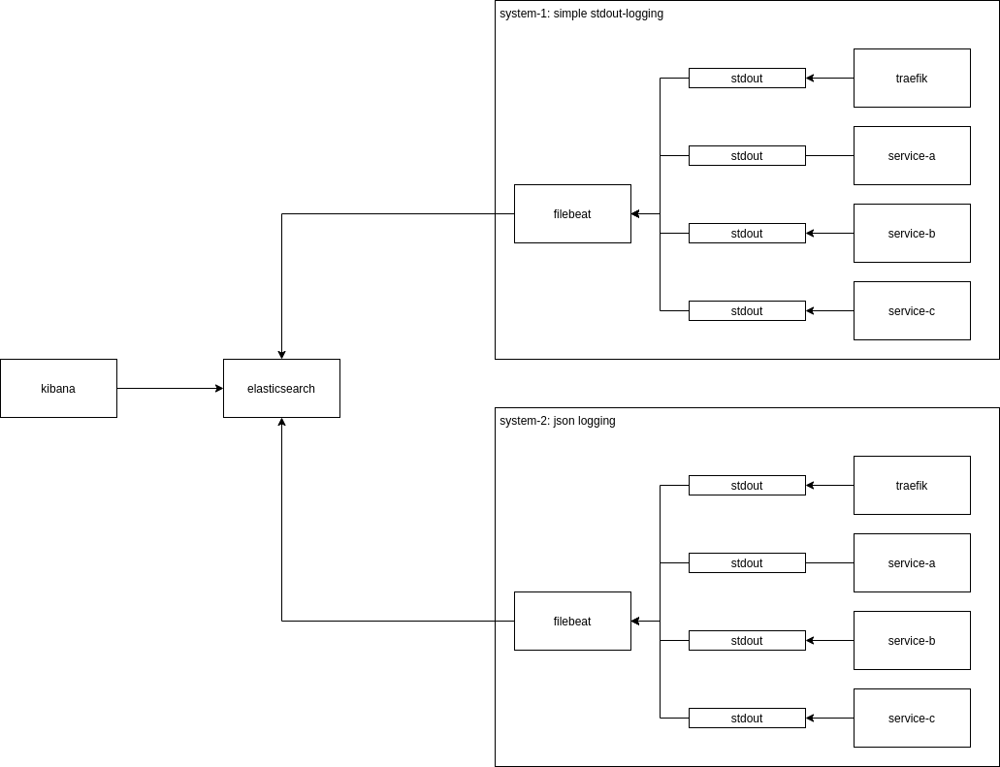

:toc:

== elk-examples

example for logging with elk-stack (even if logstash is not used at the moment)

=== testing with start.sh

[source,shell script]
----
./start.sh
----

* http://localhost:5601/app/kibana#/home
* create data view: http://localhost:5601/app/management/kibana/dataViews
** Create data view
** name: `system-1-*`
** Timestamp field: `@timestamp`
** Create data view
* Discover Data: http://localhost:5601/app/discover
* example requests
** `message:*`
* produce some logs: http://localhost:8081/

=== TODOs

* [.line-through]#update to 8.1.2#
* [.line-through]#protect elasticsearch / kibana with passwords#
* [.line-through]#ssl for all connections#
* [.line-through]#ids for different sources of logs#
* [.line-through]#use simple logs (no json)#
* [.line-through]#bring together multi-line logs (stack-traces)#
* [.line-through]#add program/service names#
* use structured logs (json)
* add metrics
* distributed tracing (services calling each other)
* check ssl-certificates
* reduce manual steps (more docker envs)
* add some visualization of errors

== filebeat-config

=== multiline-pattern

* https://www.alibabacloud.com/blog/conveniently-configure-filebeat-to-ship-multiline-logs_597454

=== kibana

* interesting fields:
** container.image.name
** message